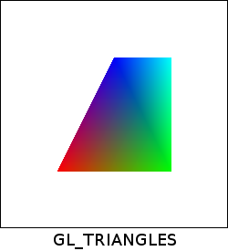
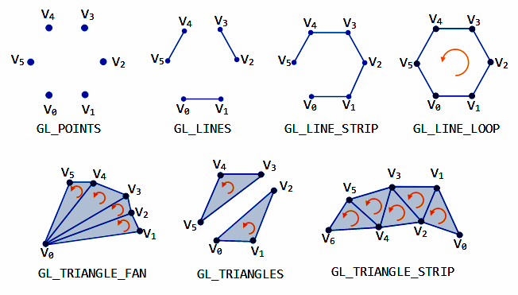
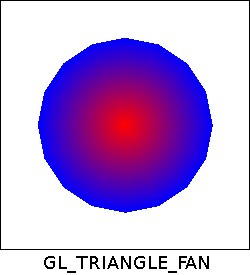
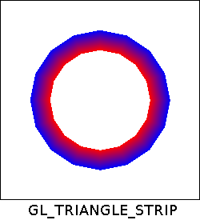
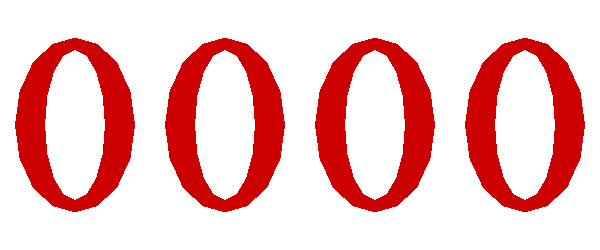

# Laboratorio 1
### Professor Eduardo Gastal - INF/UFRGS

## Tarefa 1
Compile e execute o projeto no Code::Blocks. Você deverá ver uma janela desenhada em OpenGL, como mostra a figura abaixo. Após, leia e compreenda todo o código OpenGL nos arquivos "main.cpp", "shader_vertex.glsl", e "shader_fragment.glsl". Esses incluem grande quantidade de comentários explicativos.

Note que o modo de renderização utilizado é `GL_TRIANGLES`. Utilize a figura abaixo como referência:

## Tarefa 2.1
Altere o código da função `main()` e `BuildTriangles()` para desenhar a "círculo" poligonal mostrado abaixo.

- Você deve utilizar o modo de renderização `GL_TRIANGLE_FAN`.
- O "círculo" deve conter um total de `17` vértices (um vértice central e `16` vértices ao seu redor).
- A distância de qualquer vértice externo para o vértice central deve ser `0.7` unidades (medida em normalized device coordinates; veja os comentários no código).
- Os vértices externos devem estar na cor azul, e o interno na cor vermelha.
- Os vértices de mesma posição devem ser compartilhados entre os diferentes triângulos (utilizando vetor de índices).
- Salve esta modificação no arquivo `src/main-fan.cpp` para entrega.

## Tarefa 2.2
Altere o código da função `main()` e `BuildTriangles()` para desenhar a "rosquinha" poligonal mostrado abaixo.

- Você deve utilizar o modo de renderização `GL_TRIANGLE_STRIP`.
- A "rosquinha" deve conter um total de `32` vértices (`16` vértices externos, em azul, e `16` vértices internos, em vermelho).
- A distância de qualquer vértice externo para o centro da rosquinha deve ser `0.7` unidades (medida em normalized device coordinates; veja os comentários no código). E a distância de qualquer vértice interno para o centro da rosquinha deve ser `0.5` uniddades.
- Os vértices de mesma posição devem ser compartilhados entre os diferentes triângulos (utilizando vetor de índices).
- Salve esta modificação no arquivo `main-strip.cpp` para entrega.

## Tarefa 3
Altere o código em `main.cpp` e implemente um contador binário de quatro dígitos, o qual é incrementado em uma unidade por segundo, conforme exemplo na figura abaixo.

- Utilize a função `glfwGetTime()` para obter o número de segundos que já passou desde a execução do programa. Sugestão de uso: `int seconds = (int)glfwGetTime();`.
- Para representar os dígitos do contador, você possui duas opções:
    - Primeira opção: armazenar os vértices de todos os dígitos em um único VAO, e então utilizar os parâmetros `count` e `indices` da função `glDrawElements()` para selecionar quais vértices devem ser utilizados para renderização .Veja documentação dessa [função](http://docs.gl/gl3/glDrawElements).
    - Segunda opção: armazenar os vértices de cada dígito em um VAO independente.
- Salve esta modificação no arquivo `main-binary.cpp` para entrega.

