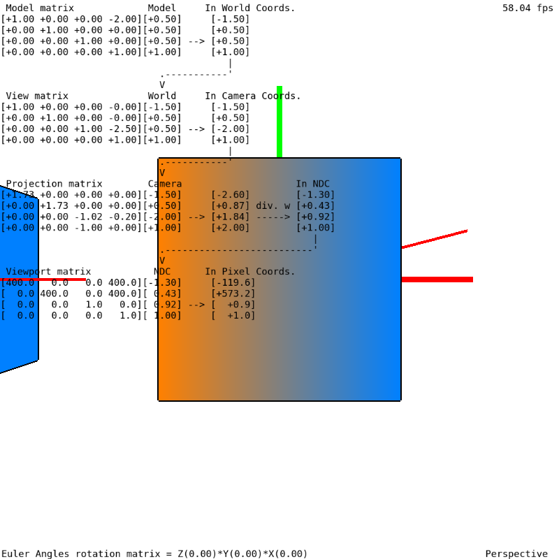

# Laboratorio 2
### Professor Eduardo Gastal - INF/UFRGS

## Tarefa 1
Preencha todo o código ausente dentro do arquivo `include/matrices.h` para que o projeto possa ser compilado no `Code::Blocks`. Este arquivo possui várias funções que definem todas as matrizes que vimos em aula, e tais funções são chamadas pelo código definido no arquivo `src/main.cpp`. Procure pelos comentários com a frase `"PREENCHA AQUI..."` nas seguintes funções do arquivo `include/matrices.h`:

- ``Matrix_Translate(...)``
- ``Matrix_Scale(...)``
- ``Matrix_Rotate_X(...)``
- ``Matrix_Rotate_Y(...)``
- ``Matrix_Rotate_Z(...)``
- ``norm(...)``
- ``Matrix_Rotate(...)``
- ``crossproduct(...)``
- ``dotproduct(...)``
- ``Matrix_Camera_View(...)``
- ``Matrix_Orthographic(...)``
- ``Matrix_Perspective(...)``

Para auxiliar na realização da tarefa, o arquivo ZIP com o código do Laboratório 2 inclui um binário pré-compilado (dentro da pasta `bin/`) do código fonte final, mostrando o resultado esperado após o preenchimento correto do código ausente em `include/matrices.h`.

Após o preenchimento de todo o código ausente, compile e execute o projeto no Code::Blocks. Se o seu preenchimento estiver correto, você deverá ver uma janela OpenGL com o conteúdo igual ao da imagem abaixo:

## Tarefa 2
Leia e compreenda todo o código OpenGL nos arquivos `main.cpp` e `shader_vertex.glsl`. Esses incluem grande quantidade de NOVOS comentários explicativos (diferentes do Laboratório 1). Em particular, preste atenção no uso de funções `glUniform*()` e `glGetUniformLocation()`, as quais são utilizadas para envio de dados para a placa de vídeo (matrizes, etc).

## Tarefa 3
Execute o programa e interaja com a cena virtual, seguindo os passos abaixo.

- Pressione o botão esquerdo do mouse e arraste para movimentar a câmera virtual;
- Utilize a "rodinha do mouse" para fazer ZOOM na câmera perspectiva (mudar distância da câmera para a origem);
- Aperte a tecla `H` para mostrar/esconder o texto informativo;
- Aperte as teclas `X`, `Y`, e `Z` para controlar os ângulos de Euler que controlam a rotação do segundo cubo. Note que os ângulos são impressos na parte inferior esquerda da janela;
    - Resete os ângulos para zero apertando a tecla `SPACE`. Após, altere, NESTA ORDEM, os ângulos de `Z`, `Y`, e `X`;
        - Note que as rotações acima ocorrem em relação ao sistema de coordenadas do modelo (o qual gira junto com o modelo);
    - Resete os ângulos para zero apertando a tecla `SPACE`. Após, altere, NESTA ORDEM, os ângulos de `X`, `Y`, e `Z`;
        - Note que as rotações acima ocorrem em relação ao sistema de coordenadas GLOBAL;
    - Resete os ângulos para zero apertando a tecla `SPACE`. Após, aperte `shift+Y` exatamente 8 vezes, e você chegará no estado de "Gimbal Lock". Agora, note que ao rotacionar com a tecla `X` e com a tecla `Z` obtemos exatamente a mesma rotação!
- Note que um dos vértices do segundo cubo está destacado com um ponto preto. Este vértice possui coordenadas de modelo `[0.5,0.5,0.5,1.0]`, e o texto informativo na tela mostra todos os sistemas de coordenadas por onde passa este ponto até chegar em NDC (normalized device coordinas);
- Aperte a tecla `O` para alterar a projeção para uma projeção ortográfica. Aperte a tecla `P` para alterar a projeção para uma projeção perspectiva;
Note que o tipo de projeção está listado na parte inferior direita da janela.

## Tarefa 4
Altere o código fonte para implementar uma câmera livre (free camera) no estilo primeira pessoa. Faça download de um binário [neste link](https://moodle.inf.ufrgs.br/pluginfile.php/134251/mod_assign/introattachment/0/Laboratorio_02_Tarefa_4_Binario.zip) para entender seu funcionamento, descrito abaixo:

- A tecla `W` deve movimentar a câmera para FRENTE (em relação ao sistema de coordenadas da câmera);
- A tecla `S` deve movimentar a câmera para TRÁS (em relação ao sistema de coordenadas da câmera);
- A tecla `D` deve movimentar a câmera para DIREITA (em relação ao sistema de coordenadas da câmera);
A tecla `A` deve movimentar a câmera para ESQUERDA (em relação ao sistema de coordenadas da câmera);
- Ao pressionar o botão esquerdo do mouse e arrastar na tela, a câmera deve rotacionar na horizontal e na vertical (mudança do vetor "view" da câmera), sem alterar sua posição, e preservando o vetor "up" igual ao eixo `Y` positivo (global). Esta movimentação simula, por exemplo, rotações da cabeça de um personagem em primeira pessoa.
- Faça download do binário no link acima e interaja com o programa para entender bem o funcionamento desta câmera.