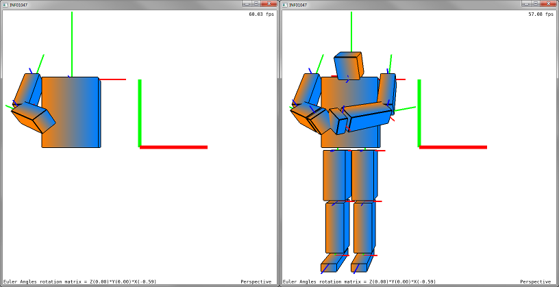

# Laboratorio 3
### Professor Eduardo Gastal - INF/UFRGS

## Tarefa 1
Altere o código fonte dentro do arquivo `src/main.cpp` para implementar transformações geométricas hierárquicas de um modelo que representa um boneco. O arquivo ZIP com o código fonte do Laboratório 3 inclui binário compilado (dentro da pasta `bin/`) mostrando o resultado esperado após você implementar estas transformações. A imagem abaixo mostra o programa sendo executado antes (esquerda) e depois (direita) das modificações que você deve fazer.

Note que o **mesmo modelo geométrico (cubo) é utilizado para desenhar todas as partes do boneco, e somente as matrizes de modelagem (Model matrix) são alteradas para desenhar cada cópia do cubo.** Para entender o funcionamento das transformações, execute o programa pré-compilado e interaja com a cena virtual, seguindo os passos abaixo:

- Pressione o botão esquerdo do mouse e arraste para movimentar a câmera virtual;
- Utilize a "rodinha do mouse" para fazer ZOOM na câmera perspectiva (mudar distância da câmera para a origem);
- Aperte as teclas `X`, `Y`, e `Z` para alterar os ângulos de Euler que controlam a rotação dos braços e da cabeça;
- Pressione o botão direito do mouse e arraste para alterar os ângulos de Euler que controlam a rotação dos antebraços;
- Pressione o botão do meio do mouse e arraste para alterar a translação do torso no plano `XY`;
- Note os eixos (vermelho, verde, e azul) desenhados em cada cubo, representando o sistema de coordenadas local de cada cópia do cubo (sistema de coordenadas do modelo).

Os seguintes objetos estão faltando e devem ser implementados por você:

- Cabeça do boneco, a qual deve rotacionar junto com os braços;
- Mão no braço direito do boneco, a qual deve se movimentar junto com o antebraço;
- Braço esquerdo completo (braço superior, antebraço, e mão), o qual deve se movimentar de maneira simétrica ao braço direito;
- Ambas as pernas do boneco, incluindo perna superior, inferior, e pé, com suas devidas proporções.

Estude o código (contém vários comentários explicativos) e faça suas alterações a partir do ponto do código em `src/main.cpp` demarcado com o comentário `##### TAREFAS DO LABORATÓRIO 3`.

Utilize como referência de transformações hierárquicas os últimos slides da [aula 08](https://moodle.inf.ufrgs.br/mod/resource/view.php?id=81177).