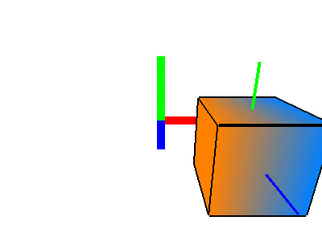

# Laboratorio 4
### Professor Eduardo Gastal - INF/UFRGS

## Atividade EAD - Animação com curva Bézier cúbica
### Cubo Voador
Utilize seu código fonte do Laboratório 2 para implementar um cubo voador cuja movimentação no espaço seja suave e definida por uma curva Bézier cúbica, conforme animação abaixo (sua animação não precisa ser exatamente igual). Utilize a função `glfwGetTime()` para fazer a animação baseada no tempo.

