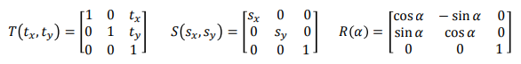
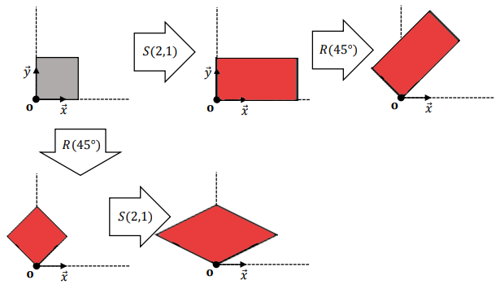
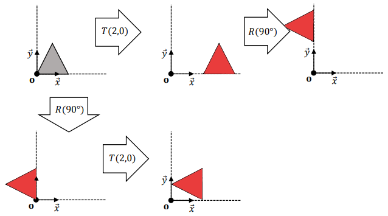

# Resolução do Questionário 1
### Rafael Baldasso Audibert (00287695)
 
---
1) Considere as transformações geométricas bidimensionais afins 𝑇, 𝑆, e 𝑅:

Ilustre, com todos os detalhes necessários, os resultados das aplicações das transformações indicadas abaixo em todos os pontos dos objetos geométricos desenhados. \
(𝑥 ,𝑦 é um sistema de coordenadas Cartesiano (ortonormal) com origem no ponto 𝐨.)

