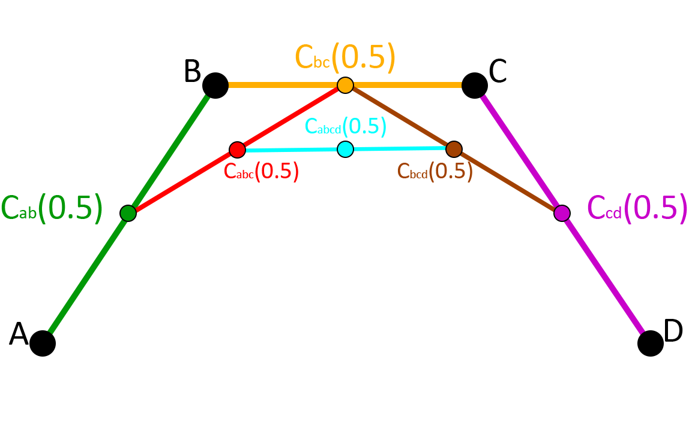
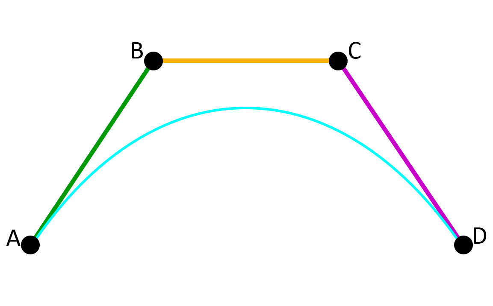
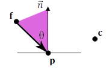
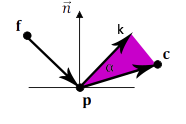

# Resolução do Questionário 3
### Rafael Baldasso Audibert (00287695)
 
---
Responda aos questionamentos abaixo com base nos conceitos discutidos em sala de aula.
Considere que todos os elementos geométricos estão definidos em um sistema de
coordenadas Cartesiano (ortonormal) com vetores de base 𝑥 ,𝑦 ,𝑧 e origem no ponto 𝐨.

1) Considere os pontos de controle 𝐚, 𝐛, 𝐜, 𝐝 na figura, cujos coeficientes são, respectivamente: (0,0); (4,6); (10,6); e (14,0).

    

    **1.1)**  Derive a representação paramétrica da curva Bézier 𝛄(𝑡), 𝑡 ∈ [0,1], para estes pontos de controle. \
    *c(t) = (1 - t)³𝐚 + 3t²(1 - t)𝐛 + 3t(1 - t)²𝐜 + t³𝐝* \
    *c(t) = (1 - t)³(0, 0) + 3t²(1 - t)(4, 6) + 3t(1 - t)²(10, 6) + t³(14, 0)* \

    *cx(t) = 14t³ + 12t²(1 - t) + 30t(1 - t)² + 0 =* \
    *_______ 14t³ + 12t² -12t³ + 30t - 60t² + 30t³ + 0 =* \
    *_______ 32t³ - 48t² + 30t* \

    *cy(t) = 18t²(1 - t) + 18t(1 - t)² =* \
    *_______ 18t(t(1 - t) + (1 - t)²) =* \
    *_______ 18t² - 18t³ + 18t - 36t² + 18t³ =* \
    *_______ 18t - 18t²*

    **1.2)**  Qual o grau desta curva Bézier? \
    *Grau 3*

    **1.3)**  Calcule os coeficientes “(𝑥, 𝑦)” do ponto 𝛄 0.5 , e ilustre o processo de geração deste ponto através de interpolações lineares sucessivas.
    
    *cx(0.5) = 32 * 0.125 -48 * 0.25 + 30 * 0.5 = **7*** \
    *cy(0.5) = 18 * 0.5 - 18 * 0.25 = **4.5***

    *(x, y) = (7, 4.5)*

    

    **1.4)**  Ilustre aproximadamente todos os pontos da curva 𝛄(𝑡).

    

2) Apresente possíveis posições dos pontos de controle para as curvas Bézier abaixo

    

3)   As três imagens abaixo foram geradas com o modelo de iluminação de Phong. Explique
a diferença visual entre as três no contexto da computação das equações de iluminação.

- *A primeira esfera foi gerada utilizando shading interpolation por face, dessa maneira a iluminação de todos os pixeis daquela face é avaliada utilizando a normal localizada no centro da face;* 

- *A segunda esfera foi gerada utilizando shading interpolation por vértice, dessa maneira a iluminação dos pixeis é calculada a partir da interpolação dos valores de iluminação nos vértices daquela face, fazendo com que nos aproximemos um pouco mais da realidade, embora possamos ter problemas em uma superfície com cantos muito agudos, fazendo com que ele pareça mais suave do que deveria ser;* 

- *A terceira esfera foi gerada utilizando shading interpolation por pixel, que é extremamente custosa, porém fica com um visual mais realista, já que a equação de iluminação é calculada em cada um dos pixeis, fazendo com que a normal seja a mais certa possível, sem aproximações;* 

4) Considere o ponto 𝐩 na figura, localizado em uma superfície planar, iluminado por uma fonte de luz posicionada em 𝐟, e visualizado por uma câmera virtual posicionada em 𝐜.

    

    **4.1)**  Sendo esta superfície um refletor difuso ideal, ilustre o ângulo 𝜃 utilizado na lei dos cossenos de Lambert para determinar a intensidade da energia luminosa refletida por 𝐩.

    

    **4.2)**  Sendo 𝑛 o vetor normal da superfície no ponto 𝐩, ilustre e defina matematicamente a direção de reflexão especular ideal para os raios de luz que atingem o ponto 𝐩 diretamente

    
    
    *Dado que l = (𝐩 - 𝐟), temos que k = -l + 2n(n • l)*

    **4.3)**  Sendo esta superfície um refletor especular “glossy,” ilustre o ângulo 𝛼 utilizado no modelo de iluminação de Phong para determinar a intensidade da energia luminosa refletida por 𝐩 que atinge a câmera virtual.

    
